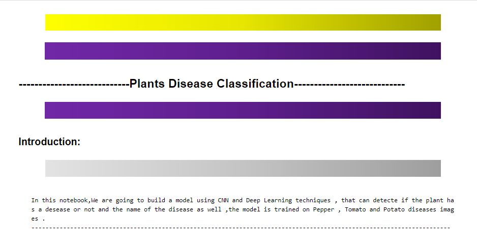
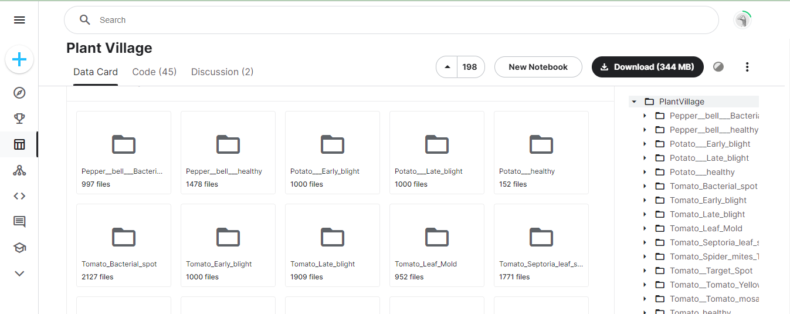
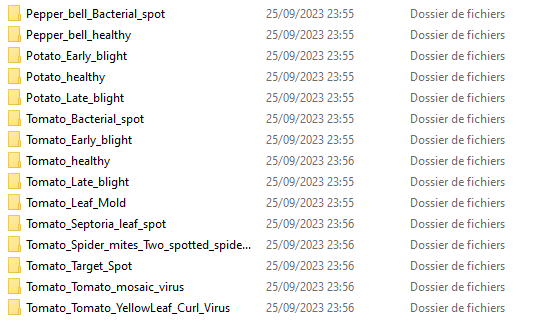
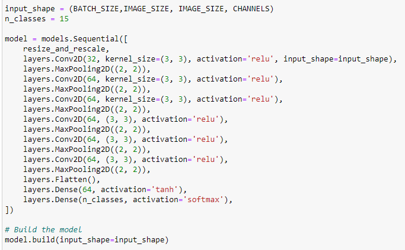
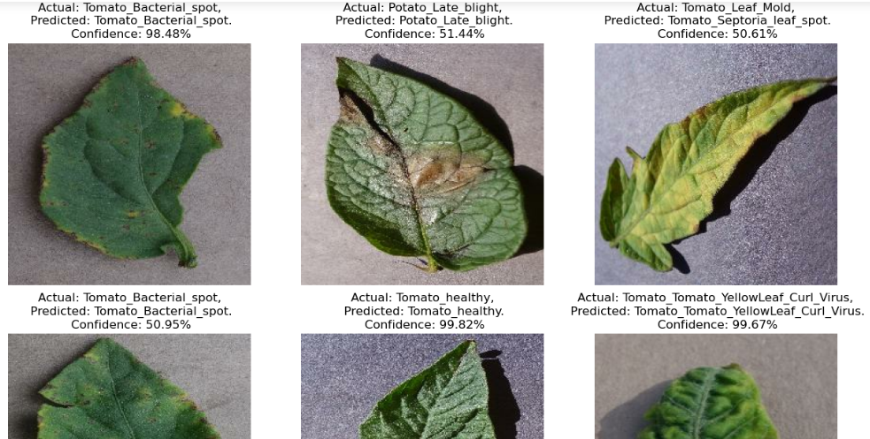
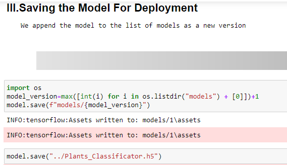

# Plants Disease Classification

 In this notebook,We are going to build a model using CNN and Deep Learning techniques , that can detecte if the plant has a desease or not and the name of the disease as well ,the model is trained on Pepper , Tomato and Potato diseases images ..



## Overview

Before starting , the Dataset Link is : https://www.kaggle.com/arjuntejaswi/plant-village.



then our repo looks like:



Next, before starting to build models, we must perform exploratory data analysis to understand the data.


Next , we split the dataset to Train, validation and Test datasets, then we will use CNN and neural network on the training dataset and accuracy metrics to evaluate the model 


Then comes the step of building the model:



Then we visualise the inferance/predections of our model:



In the end , we will save the results.



## Table of Contents

- [Installation](#installation)
- [Usage](#usage)


## Installation

To use the Notebook and considering you have Python installed, you will need to install the following dependencies:
 - tensorflow
 - matplotlib
 - numpy


You can install the required packages using pip. Here's an example command:
```bash
pip install -r requirements.txt
```
<span style="color:red">Make sure that you navigate to your project folder inside the PROJECT folder, which contains the requirements.txt file.</span>

## Usage

After you installed the required packages,you can run the notebook and visualise the results .

<span style="color:yellow">You must know that to run the whole notebook it may take few hours to run due the massive amount of calculations it does , especially if you dont have a GPU!!.</span>


